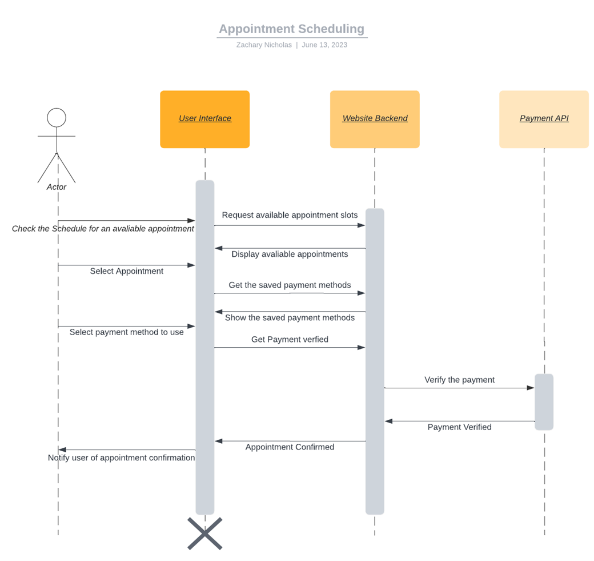

# DriverPass: Online Driver Training and Scheduling System

This repository contains the design, development, and implementation details for DriverPass—a system that integrates online driver training, practice testing, and scheduling capabilities. The system offers a seamless experience for users and role-based functionalities for administrators, customers, and instructors.

---

## Overview

DriverPass is designed to address a gap in the driver training market by providing a robust solution for scheduling appointments, online driver training, and in-person road tests. It combines modular architecture with secure operations to meet the diverse needs of its users.

---

## Key Features

### Driver Training

- **Online Training and Tests**: Includes driver training tools, such as practice tests and courses, accessible through a web-based platform.
- **Driving Packages**: Offers three different driving packages tailored to user needs.

### Scheduling System

- **User Authentication**: Secure login with password validation and two-factor authentication.
- **Appointment Scheduling**: Enables booking, modifying, and canceling appointments.
- **Payment Integration**: Processes payments through a backend API with real-time updates.

### Role-Based Access

- **Customers**: Schedule appointments, take online classes/tests, and manage driving packages.
- **Instructors**: Monitor and manage available time slots and appointments.
- **Administrators**: Manage system settings, view data, and oversee user accounts.

---

## Technical Components

### System Requirements

- **Host Machine**: Runs the database and web interface for customers and staff.
- **Platform**: Web-based system on Linux, with cloud integration for backend databases and enhanced security.
- **Performance**: Designed for fast and efficient operation without lags or delays.

### Security Features

- **User Authentication**: Validates credentials and restricts access after repeated failed login attempts.
- **Data Encryption**: Secures the exchange of user data between client and server.
- **Password Recovery**: Offers email-based reset links for forgotten passwords.

### System Adaptability

- **User Modifications**: Allows adding/removing users without requiring code changes.
- **Platform Updates**: Supports incremental updates to integrate new features over time.
- **Admin Access**: Grants full system control to IT administrators.

---

## UML Diagrams

### 1. Use Case Diagram

Visualizes user interactions with the system, such as booking appointments, resetting passwords, and tracking availability.

### 2. Activity Diagram

Details workflows, including scheduling appointments and validating payments.

### 3. Sequence Diagram

Outlines the sequence of operations between system components during tasks like payment processing and appointment confirmation.

### 4. Class Diagram

Defines relationships and attributes for classes such as **User**, **Instructor**, **Appointment**, and **Customer**.

---

## Process Flow

### Appointment Scheduling Workflow:

1. Browse available slots via the user interface.
2. Select an appointment and input payment details.
3. Validate payment through the backend and API.
4. Confirm the appointment and notify the customer and instructor.

### User Login Workflow:

1. Prompt for user credentials and authenticate login.
2. Track failed login attempts with thresholds and recovery options.

---

## Assumptions and Limitations

- **Assumptions**:
  - Adequate budget and availability of necessary resources.
  - Reliable supply chains for tools and technologies.
- **Limitations**:
  - Time constraints of 5 months with limited personnel.
  - Use of an agile approach for task prioritization and tracking progress.

---

## Gantt Chart

- Includes a project timeline for development milestones created with Lucidchart.
  

---

## Future Improvements

- Enhance security measures with features like two-factor authentication.
- Optimize appointment scheduling workflows for ease of use.
- Expand system scalability to integrate external services and modules.

---

## Project Summary

DriverPass is a company aiming to improve the way student drivers prepare for their driving exams and schedule practical driving tests. Our task was to design a website where customers can create accounts, purchase study packages, take practice tests online, and schedule appointments with instructors for practical driving lessons.

---

## Strengths of the Project

The diagrams and their explanations were particularly effective in conveying the core systems required for the platform. The visuals clearly illustrated the necessary components and helped in defining the system's scope.

---

## Areas for Improvement

I would improve the design by making it more comprehensive, including additional features and enhancing the depth of the system designs. Additionally, I would expand the business requirements documentation, particularly to describe the system's constraints and limitations more thoroughly.

---

## Addressing User Needs

I approached the design by focusing on the users’ technical requirements. I created use cases and diagrams to map out the system based on the given requirements. Understanding the user's needs is crucial as they dictate the direction of the website’s functionality, ensuring a user-centered design.

---

## Future Design Approach

When designing software, I believe defining functional and non-functional requirements is essential. In future projects, I plan to use diagrams to illustrate system workflows and communicate designs effectively, whether in an agile environment with a scrum leader or directly with the client.

## License
This project is licensed under the MIT License. You are free to use, modify, and distribute this software.
